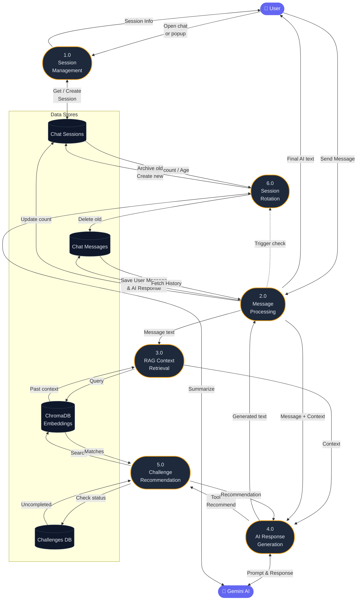
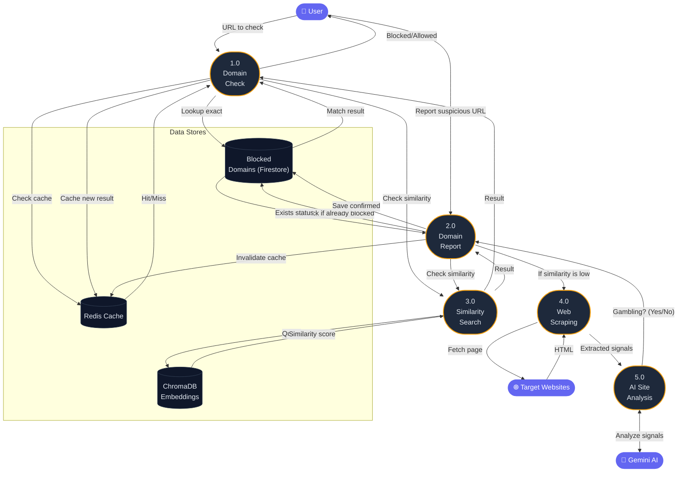

# Gamebless — Data Flow Diagrams

---

## Level 0 — Context Diagram

> *This diagram shows the Gamebless System as a single process interacting with all external entities. The data flows are high-level to represent the overall purpose of each connection.*

```mermaid
flowchart TD
    USER(["👤 User / Mobile App"])
    FIREBASE(["🔐 Firebase Auth"])
    WEBSITES(["🌐 Target Websites"])

    GAMEBLESS["⚙️ Gamebless System"]

    FIRESTORE[("🗄️ Firestore<br/>(Main Database)")]
    GEMINI(["🤖 Gemini AI"])
    CHROMA[("🔍 ChromaDB<br/>(Vector Database)")]
    REDIS[("⚡ Redis<br/>(Cache)")]

    %% User Interactions
    USER <-->|"App requests & responses<br/>(Chat, Checks, Progress)"| GAMEBLESS
    
    %% Authentication
    FIREBASE <br/> Authentication -->|"Identity verification"| GAMEBLESS

    %% Main Database
    GAMEBLESS <-->|"Read/Write all application data<br/>(Users, Chat, Domains, Challenges)"| FIRESTORE

    %% AI & Processing
    GAMEBLESS <-->|"AI prompts & generated responses"| GEMINI
    GAMEBLESS <-->|"Store & search context<br/>embeddings"| CHROMA
    GAMEBLESS <-->|"Cache frequent responses"| REDIS
    GAMEBLESS -->|"Fetch site content"| WEBSITES

    classDef entity fill:#6366f1,color:#fff,stroke:none
    classDef process fill:#1e293b,color:#e2e8f0,stroke:#f59e0b,stroke-width:2px,rx:10
    classDef store fill:#0f172a,color:#e2e8f0,stroke:#334155
    class USER,FIREBASE,WEBSITES,GEMINI entity
    class GAMEBLESS process
    class FIRESTORE,CHROMA,REDIS store
```

---

## Level 1 — Chat Module

> *This diagram breaks down the Chat functionality. Layout is top-down to improve readability.*



---

## Level 1 — Domain Module

> *This diagram breaks down the Domain Checking and Reporting logic.*


