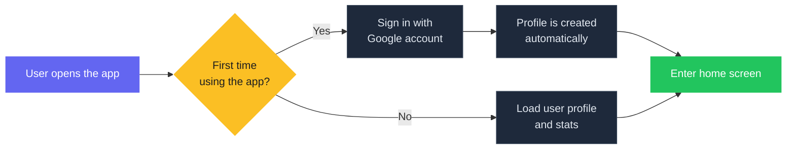
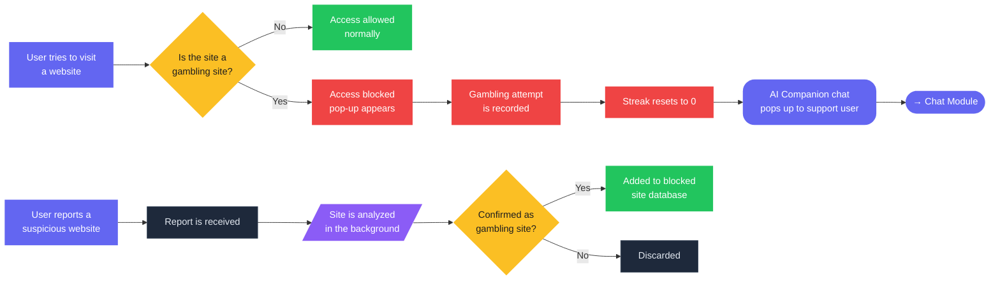
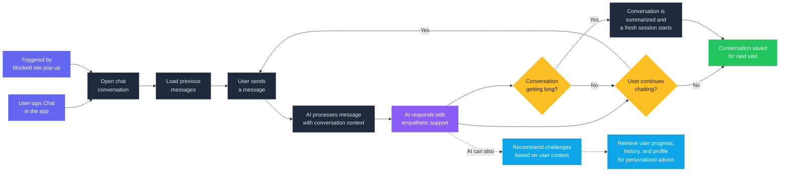
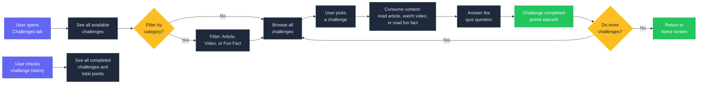
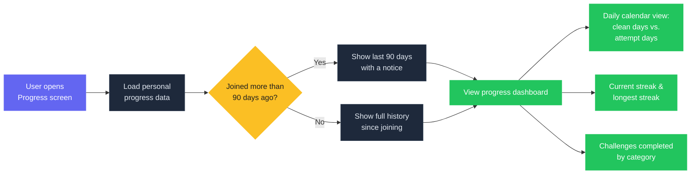
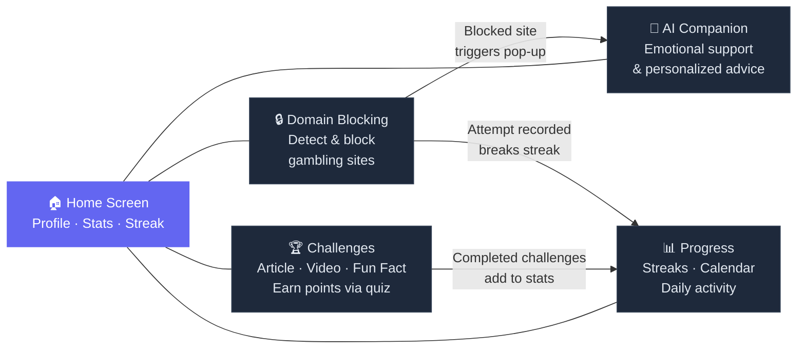

# Gamebless — Application Flowcharts

> How the Gamebless app works, from the user's perspective.

---

## 1. Auth & Onboarding

---

## 2. Domain Blocking

---

## 3. AI Chat Companion

---

## 4. Challenges

---

## 5. Progress & Streaks

---

## Module Interaction Overview

